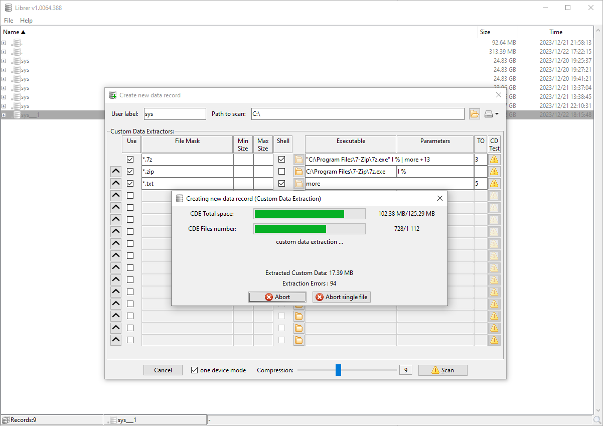

#  LIBRER

A cross-platform GUI file cataloging program with extensive customization options to suit user preferences. Highly optimized for multi-core parallel search speed, data integrity, and repository portability.

**The software and this document are under development and in a Release Candidate (3) state.**

## Features:
The primary purpose of this software is to enable users to catalog their files, especially on removable media such as memory cards and portable drives. It allows user to add metadata, referred to here as **custom data**, and later search the created records with multiple cryteria. **Custom data** consists of textual information acquired through the execution of user-chosen commands or scripts. **Custom data** may include any text data customized to meet the user's requirements, restricted only by the available memory and the software accessible for data retrieval. The retrieved data is stored in a newly created database record and can be utilized for search or verification purposes. **Liber**  allows you to search files using regular expressions, glob expressions and **fuzzy matching** on both filenames and **custom data**. Created data records can be exported and imported to share data with others or for backup purposes.

## Screenshots:

main window, new record creation dialog and running **custom data** extraction:


#### Search dialog:


#### Context menu:


## Download:
Portable executable packages created with [PyInstaller](https://pyinstaller.org/en/stable) for **Linux** and **Windows** can be downloaded from the Releases site:

https://github.com/PJDude/librer/releases


## Guidelines for crafting custom data extractors
Custom data extractor is a command that can be invoked with a single parameter - the full path to a specific file from which data is extracted. The command should provide the expected data in any textual format to the standard output (stdout). CDE can be an executable file (e.g., 7z, zip, ffmpeg, md5sum etc.) or an executable shell script (extract.sh, extract.bat etc.). The conditions it should meet are reasonably short execution time and reasonably limited information output. The criteria allowing the execution of a particular **Custom data extractor** include the glob expression (on file name) and the file size range.

## [Tutorial](./info/tutorial.md) ##    

## Usage tips:
- don't put any destructive actions in your Custom Data Extractors scrips
- try to keep as little custom data as possible, to speed up scanning and searching records and keep record files small
- if general purpose and generally available tools produce too much and not needed text data, write a wrapper script (*.sh, *bat) executing specific tool and post-process retrieved data. Wrapper can also help when the tool expects more variable parameters or in an unusual order
- You don't have to use Custom Data if you don't need to. Only the file system will be cataloged.

## Supported platforms:
- Linux
- Windows (10,11)

## Portability
**librer** writes log files, configuration and record files in runtime. Default location for these files is **logs** and **data** subfolders of **librer** main directory.

## Technical information
Record in librer is the result of a single scan operation and is shown as one of many top nodes in the main tree window. Contains a directory tree with collected custom data. It is stored as a single .dat file in librer database directory. Its internal format is optimized for security, fast initial access and maximum compression (just check :)) Every section is a python data structure serialized by [pickle](https://docs.python.org/3/library/pickle.html) and compressed separately by [Zstandard](https://pypi.org/project/zstandard/) algorithm. The record file, once saved, is never modified afterward. It can only be deleted upon request or exported. All record files are independent of each other.Fuzzy matching is implemented using the SequenceMatcher function provided by the [difflib](https://docs.python.org/3/library/difflib.html) package. Searching records is performed as a separate subprocess for each record. The number of parallel searches is limited by the CPU cores. 

###### Manual build (linux):
```
pip install -r requirements.txt
./scripts/icons.convert.sh
./scripts/version.gen.sh
./scripts/pyinstaller.run.sh
```
###### Manual build (windows):
```
pip install -r requirements.txt
.\scripts\icons.convert.bat
.\scripts\version.gen.bat
.\scripts\pyinstaller.run.bat
```
###### Manual running of python script:
```
pip install -r requirements.txt
./scripts/icons.convert.sh
./scripts/version.gen.sh

python3 ./src/librer.py
```

## Ideas for future development
-   gather **custom data** (generated also by user scripts) not only as text but also as binary files and store them inside record file (e.g. image thumbnails etc.)
- calculate the **CRC** of scanned files and use it to search for duplicates among different records, verify current data with the saved file system image
- comparing two records with each other. e.g. two scans of the same file system performed at different times

## Known issues
For still unknown reason, Custom Data Extraction (Execution of tons of subprocesses) on the exact same hardware is much slower on Windows than on Linux.  

## Licensing
- **librer** is licensed under **[MIT license](./LICENSE)**
