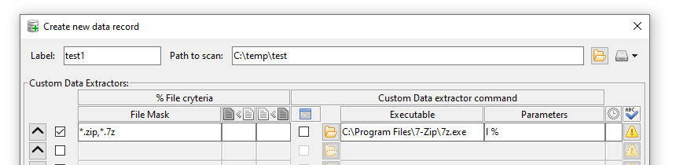
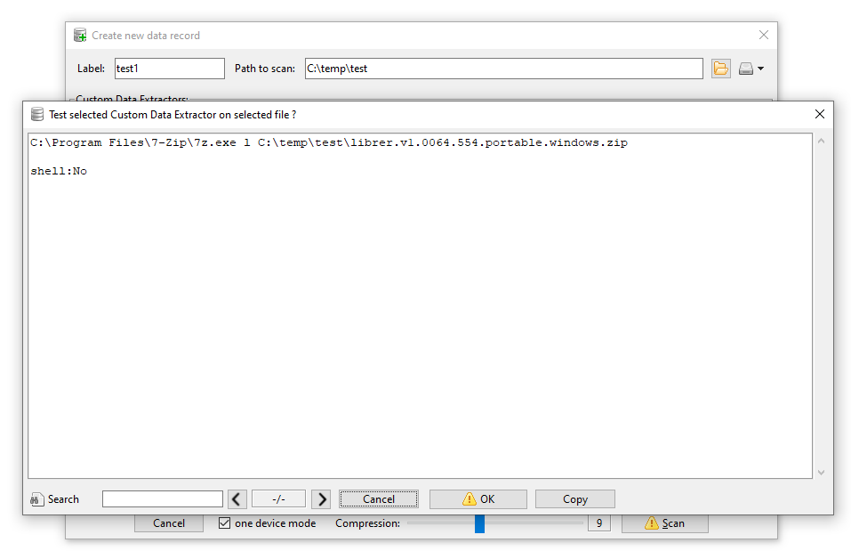
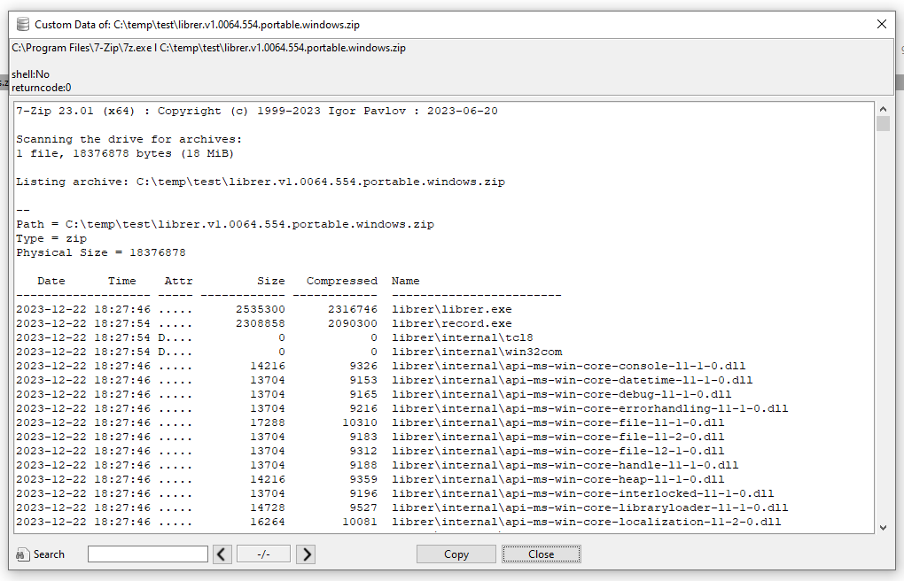
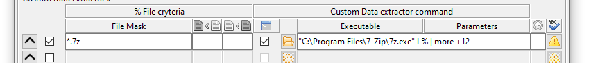
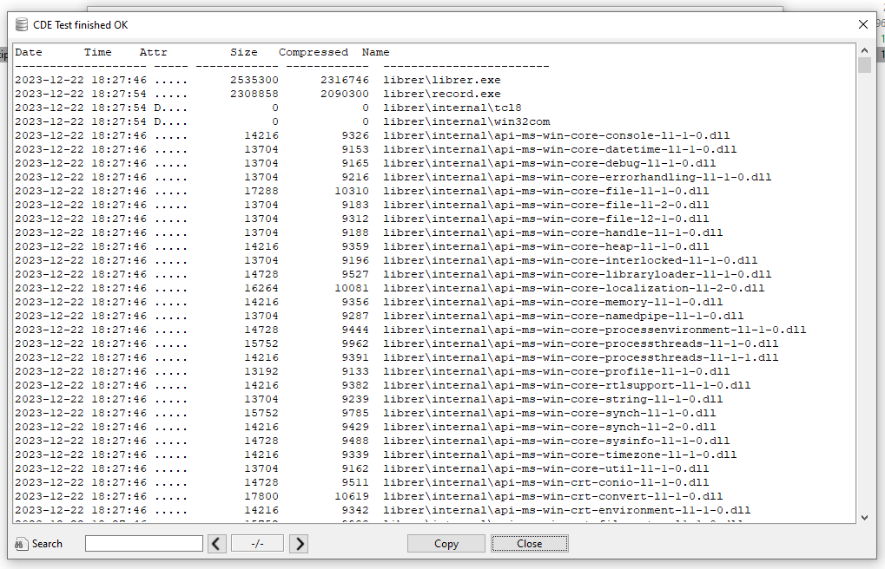
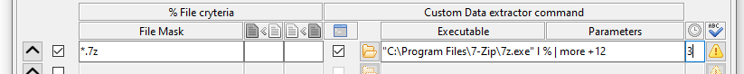
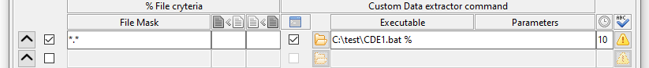
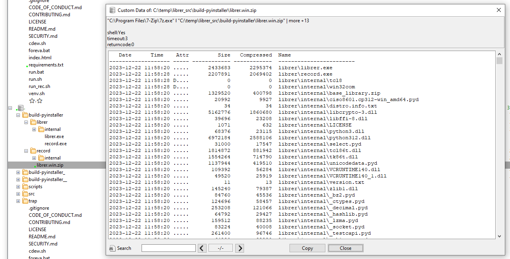
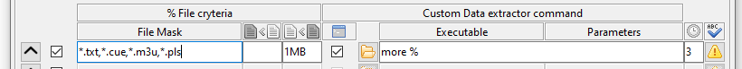

Let's assume we have a couple of portable drives with backups and multiple archives and we want to create a catalogue with their contents. If we have [7zip](https://7-zip.org/) installed, we can use it to list the contents of an archive (the 'l' parameter lists contents of an archive). On the command line for a single file it might look like this:

>"C:\Program Files\7-Zip\7z.exe" l E:\my_archive_001.7z

How to apply this in **librer** ? Create Custom Data extractor like this:



Now we can test new Custom Data Extractor (warning yellow icon on the right) and run it on selected file



The Custom Data extractor worked fine on the selected file:



The result is ok, but the header generated by 7zip is something we don't really need. The simplest option is to get rid of the first 12 lines. To do this, you need to improve the executed command, execute it in the system shell and use pipes. See below. Note that a command with the "Shell" option enabled has one common field for the command and parameters. Now path to 7zip requires quotes (space sign in "Program Files" section). 
The information generated by 7zip will be piped to the "more" command with the +12 parameter, resulting in the first 12 lines being skipped.



result:



There is no need to enclose the % character representing the processed file with quotation marks. Librer will do this internally. What if there is a problem during processing? E.g. What if the file is password protected and 7z expects user interaction and asks for password ? If we really want to open such an archive, we must enter the password for our command. However, we would most likely want to skip such a file. To do this, simply set a timeout value. A few seconds will usually be more than necessary. Once the timeout expires, the extraction of custom data from the file will be terminated.

Below is CDE with timeout set to 3 (seconds). A timeout can be set for both shell and non-shell CDE commands. Upon timeout or manual abort, which is also possible, the entire subprocess tree will be terminated. 



What if we need to implement a more complex condition? E.g. file processing must depend on modification time, last access time or something else? In this case, it would be best to start setting the script as CDE.



Inside such script passed file will be mapped as first parameter (%1 on Windows). example:

```
@echo CDE test
"C:\Program Files\7-Zip\7z.exe" l %1 | more +12
@echo test finished
```
All of the above will apply to Linux as well, with consideration of obvious differences

Once we have the full set of custom data extractors set up and tested, we can start scanning the media we want to catalog. Once a new record is created, files with successfully collected custom data will be shown with a small green dot. A double click or menu action allows you to view the data and commands used to extract. The collected data is searchable 



## Examples of other Custom Data extractors

> "more"  - Listing the contents of the entire file. May be applied to *.cue files or media playlists *.m3u or any text files (windows). Similarly on Linux we can use "cat"


> "[ffprobe](https://ffmpeg.org/ffprobe.html) -hide_banner" - get media tags and other metadata from media files like *.mp3 etc.

> "[exiftool](https://exiftool.sourceforge.net/)" get exif data from images like *.jpg and many more

> "[pdftotext](https://linux.die.net/man/1/pdftotext) - - <" - get text content of pdf file

> "strings" - get printable strings from any file
