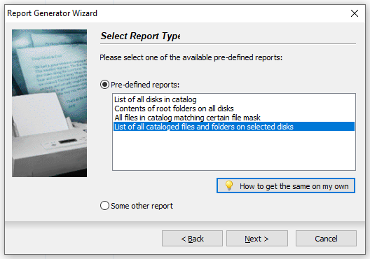

Librer allows to import data from "Where Is It?" software indirectly by reading it's xml report file.

How to import data ? You need to save information about all files catalogued by "Where Is It?"

in "Where Is It?":
- Start Report Generator Wizard
- on "Select report type" page select the Pre-defined report "List of all cataloged files and folders on selected disks"

 
- In the Report Generator window, select export to "XML file". All options set as below: 


- clik Export and save XML file

in Librer use File menu action: 'Import "Where Is It?" xml ...'

## unregistered Where Is It? version issue
Unregistered version of WII pollutes its own report by replacing some data with ```*** DEMO ***``` string. Imported data from such report will be obviously  incomplete, however the ```*** DEMO ***``` string seems to be inserted randomly, so in sequential writes it appears in different sections. After couple of exports, with a little luck pool of report files will contain all data scattered in different files. Import all that reports at once in single shot (!) to merge the data into complete dataset. To do that use multiselection on import dialog. Incomplete data will be ignored and will not apear in librer records.

💥 "Where Is It" Lite" version can be used to avoid this problem - see [Export XML report using WhereIsIt Lite freeware](https://github.com/PJDude/librer/discussions/7)

